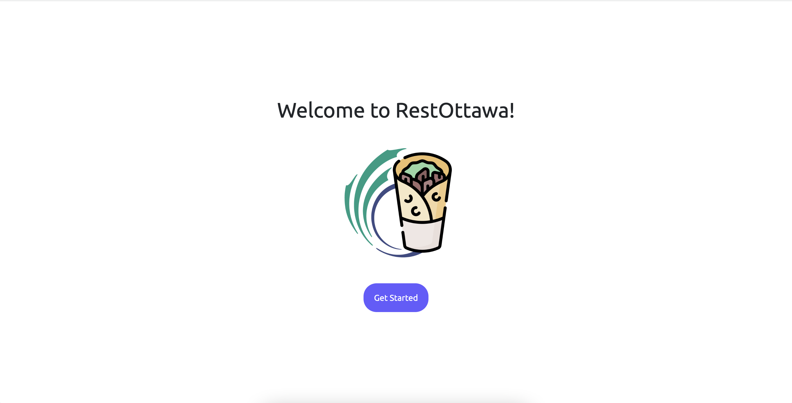

# restottawa

## Description

A web app for finding nearby restaurants that you may like.

Utilizes Google Maps' [Places API](https://developers.google.com/maps/documentation/places/web-service) for finding the restaurants and fast food joints.



## Setup

1. Git clone the repo
2. Create a Python virtual environment (steps for UNIX and Unix-like systems below)

```sh
python -m venv venv
source venv/bin/activate
```

3. Install pip packages

```sh
pip install -r requirements.txt
```

4. Create .env file in root project folder

```sh
touch .env
```

5. Add the following line in the .env file and paste your Google Maps Place's API key

```
API_KEY=your_key_goes_here
```

6. Run the web app

```sh
python app.py
```
